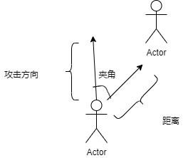

# 攻击手段

### 近距离攻击

#### 函数名

`CloseAttack`

#### 参数：

`float x` 所要攻击的方向的x值

`float y` 所要攻击的方向的y值

#### 具体说明

近距离攻击会通过判断附近一定范围是否有敌人，敌人是否在攻击方向的一定范围内从而攻击

不同兵种有不同的 `攻击范围 攻击距离 攻击力`

只有当敌人与选手控制的`player`的距离 `<=` 攻击距离

同时攻击方向和敌人的位置的夹角 `<=` 攻击范围

攻击才生效

<figure><figcaption></figcaption></figure>
