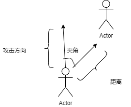

# 选手方法

### 信息获取

#### 函数名

`player getMyself()`

#### 具体说明：

返回一个player，存储玩家自身的相关数据

#### 函数名

`List<enemy> getEnemy()`

#### 具体说明：

返回一个enemy列表，存储周围十米范围内敌方的相关数据

#### 函数名

`List<wall> getWalls()`

#### 具体说明

返回一个wall列表，存储场上所有障碍物的信息

#### 函数名

`List<coin> getCoin()`

#### 具体说明：

返回一个coin列表，存储场上所有金币的信息

#### 函数名

`List<buff> getBuff()`

#### 具体说明

返回一个buff列表，存储场上所有的buff信息

#### 函数名

`List<bullet> getBullet()`

#### 具体说明

返回一个bullet列表，存储场上所有子弹的信息

### 玩家操作

#### 函数名

`void moveTo(float x, float y)`

#### 参数：

`float x` 目标点的x值

`float y` 目标点的y值

#### 具体说明：

让玩家向目标点移动

#### 函数名

`void CloseAttack(float x, float y)`

#### 参数：

`float x` 所要攻击的方向的x值

`float y` 所要攻击的方向的y值

#### 具体说明

近距离攻击会通过判断附近一定范围是否有敌人，敌人是否在攻击方向的一定范围内从而攻击

不同兵种有不同的 `攻击范围 攻击距离 攻击力`

只有当敌人与选手控制的`player`的距离 `<=` 攻击距离

同时攻击方向和敌人的位置的夹角 `<=` 攻击范围

攻击才生效

<figure><figcaption></figcaption></figure>

#### 函数名

`void RemoteAttack(float x, float y)`

#### 参数：

`float x` 所要攻击的方向的x值

`float y` 所要攻击的方向的y值

#### 具体说明：

向目标点发射子弹，弹匣清空时调用无效

#### 函数名

`void reload()`

#### 具体说明：

切换弹匣，从弹匣1切换到弹匣2，或者从弹匣2切换到弹匣1，有1秒的换弹时间

#### 函数名

`int ChangeType(int type)`

#### 参数：

`int type` 想要变化的兵种

#### 具体说明：

???
